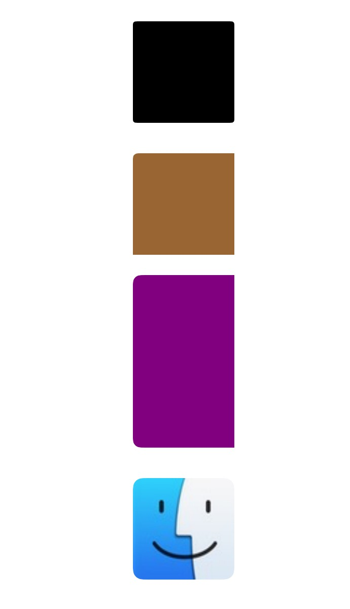

# LPViewCornerRadiusMaker
UIView extension for making UIView cornerRadius

# Install

`pod 'LPViewCornerRadiusMaker', '~> 0.0.1'`

# Usage

```swift
// make edges cornerRadius with default radius
- (void)makeCornerRadius;
// make cornerRadius for a position
- (void)makeCornerRadiusWithRadius:(CGFloat)radius position:(LPCornerRadiusPosition)position;
// make cornerRadius for some positions
- (void)makeCornerRadiusWithRadius:(CGFloat)radius positions:(NSArray *)positions;
```

# Screenshot



# TODO

- [ ] test in WKWebView

# Release Notes

- 0.0.1

first commit

